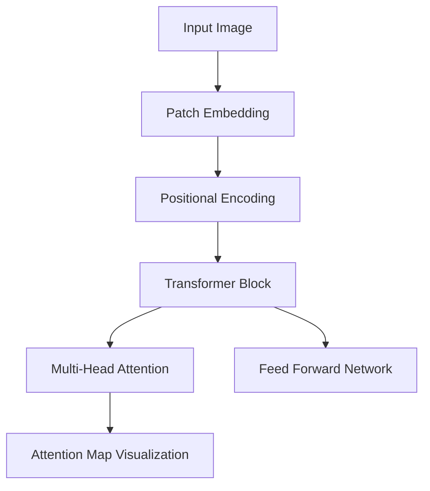

# Attention From Scratch: Deep Learning Fundamentals

A clean, industrial-grade implementation of the Transformer mechanism from the ground up using PyTorch. This project serves as a cornerstone for the "Specialization in Transformers and SOTA" cycle, moving from raw multi-head attention to a functional Vision Transformer (ViT) pipeline.

## 🚀 Key Features

- **Industrial-Grade Initialization**: Xavier/Glorot uniform initialization for weights and zeroed biases.
- **Numerical Stability (FP16 Ready)**: Implements Softmax upcasting to `float32` and `register_buffer` for non-trainable state (Positional Encodings).
- **Mathematical Parity**: Verified against PyTorch's native `nn.MultiheadAttention` with a relative error $< 10^{-6}$.
- **Vision Bridge**: Includes `PatchEmbedding` layer to bridge Convolutional images with Attention sequences.
- **Explainable AI**: Custom scripts for visualizing attention heatmaps and positional frequency patterns.

## 🏗️ Architecture Overview



## 📐 The Math Behind

The core of the system is the **Scaled Dot-Product Attention**:

$$ \text{Attention}(Q, K, V) = \text{softmax}\left(\frac{QK^T}{\sqrt{d_k}}\right)V $$

In our implementation, we ensure memory alignment by transposing heads into the "God Shape" `(Batch, Heads, Seq, Dim_k)`, allowing for massive parallelism without explicit Python loops.

## 💻 How to Run

### Installation
```bash
# Recommended: use uv or venv
pip install torch matplotlib
```

### Parity Check
Verify that our implementation matches PyTorch's internal C++ kernels:
```bash
python3 parity_check.py
```

### Full Vision Pipeline
Run a smoke test for the bottom-up ViT setup:
```bash
python3 test_full_pipeline.py
```

### Visualize Positionals
See the sinusoidal "clock" frequency pattern:
```bash
python3 test_positional.py
```

## 📚 Documentation
Detailed technical deep dives are available in the `doc/` directory:
1. `01_attention_is_all_you_need_overview.md`
2. `02_transformation_functions.md`
3. `03_1_implementation_explained.md`
4. `03_implementation_guide.md`
5. `04_vision_bridge_and_stability.md`

---
**Author:** Paulo Menezes  
**Status:** Epic [Attention From Scratch] - **COMPLETE** ✅