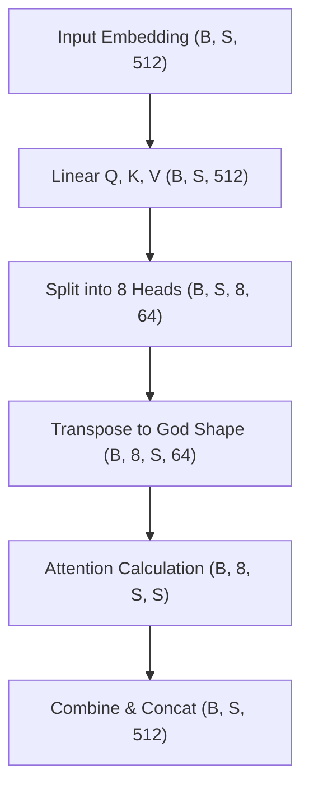

# 02. Transformation Functions (Tensor Shaping)

This document describes the data transformation flow (tensor dimensions) during the Multi-Head Attention mechanism.

As discussed previously, the core idea of Multi-Head Attention is to parallelize execution and training. This is achieved by splitting the total embedding vector (e.g., size 512) into multiple heads (e.g., 8 heads of size 64 each).

## 0. Notation Glossary

To understand the transformations below, we use the following standard notation:

| Symbol | Definition | Description |
| :--- | :--- | :--- |
| **$B$** | **Batch Size** | Number of independent sequences processed in parallel. |
| **$S$** | **Sequence Length** | Number of tokens (words or image patches) in a single sequence. |
| **$h$** | **Heads** | Number of parallel attention mechanisms (Heads). |
| **$d_{model}$** | **Model Dimension** | Total size of the embedding vector (e.g., 512). |
| **$d_k$** | **Head Dimension** | Size of the feature vector per head ($d_k = d_{model} / h$). |

---

## 1. Mapping Transformations (Tensor Shaping)

To mitigate the risk of `RuntimeError: size mismatch` and ensure massive GPU parallelization without explicit Python loops, rigorous manipulation of tensor axes is mandatory. 

The architecture converges to what we call the **"God Shape"**: $(B, h, S, d_k)$. This specific arrangement is called "God Shape" because it places the Heads dimension ($h$) immediately after the Batch ($B$), allowing PyTorch to treat each head as an independent batch item. This enables the hardware to perform the attention calculation across all heads simultaneously.

### Shape Progression

| Stage | Operation | Input Shape | Output Shape | Technical Rationale |
| :--- | :--- | :--- | :--- | :--- |
| **Linear Projection** | $X W_{Q,K,V}$ | $(B, S, d_{model})$ | $(B, S, d_{model})$ | Linear projection into Query, Key, and Value sub-spaces. |
| **Split Heads** | `view()` | $(B, S, d_{model})$ | $(B, S, h, d_k)$ | Fragmenting the $d_{model}$ vector into $h$ sub-vectors of dimension $d_k$. |
| **God Shape** | `transpose(1, 2)` | $(B, S, h, d_k)$ | **$(B, h, S, d_k)$** | Swapping axes to treat heads as a parallel batch dimension. |
| **Attention Map** | $Q K^T$ | $(B, h, S, d_k) \times (B, h, d_k, S)$ | **$(B, h, S, S)$** | Generating the token-to-token affinity matrix across all sub-spaces. |
| **Value Context** | $\text{Score} \cdot V$ | $(B, h, S, S) \times (B, h, S, d_k)$ | $(B, h, S, d_k)$ | Semantic contextualization via weighted average of values. |

> [!IMPORTANT]
> The dimension $d_k$ is derived from $d_{model} / h$. In the original paper, $512 / 8 = 64$. Training is optimized when using powers of 2 for memory alignment in CUDA kernels.

---

## 2. Gradient Stabilizer: Scaling Factor ($1/\sqrt{d_k}$)

The use of a scaling factor is not empirical but a necessity for numerical stability.

### Mathematical Foundation
Let $q$ and $k$ be components of vectors of dimension $d_k$, assumed to be independent random variables with $\mu=0$ and $\sigma^2=1$.

1.  **Dot Product:** $q \cdot k = \sum_{i=1}^{d_k} q_i k_i$.
2.  **Variance of the Sum:** $\text{Var}(q \cdot k) = \sum_{i=1}^{d_k} \text{Var}(q_i k_i) = d_k$.
3.  **The Softmax Problem:** As $d_k$ increases, the variance of the dot product grows linearly. High-magnitude inputs to the Softmax function result in "one-hot-like" distributions, where the local gradient approaches zero (Saturation).

### The Solution
By applying the $1/\sqrt{d_k}$ factor, we normalize the variance of the input distribution before activation:
$$\text{Var}\left(\frac{QK^T}{\sqrt{d_k}}\right) = \frac{1}{d_k} \text{Var}(QK^T) = \frac{d_k}{d_k} = 1$$

This keeps the calculation within the region of maximum gradient flow for the Softmax function, preventing **Vanishing Gradients**.

---

## 3. Causality: Masked Multi-Head Attention

Unlike the Encoder, the Decoder requires a guarantee of **non-anticipation** (causality).

### The Look-ahead Mask Mechanism
During training (Teacher Forcing), the model has access to the full sentence. To prevent **Information Leakage** from the future, we apply an upper triangular mask.

1.  **Mask Matrix ($M$):**
    $$M_{i,j} = \begin{cases} 0 & \text{if } i \ge j \\ -\infty & \text{if } i < j \end{cases}$$
2.  **Application:** $\text{Softmax}\left(\frac{QK^T + M}{\sqrt{d_k}}\right)$
3.  **Result:** Values marked with $-\infty$ become $0$ after Softmax ($e^{-\infty} = 0$).

> [!NOTE]
> This mechanism ensures that the hidden state of the token at position $i$ is computed using only information from positions $0, \dots, i$. During inference, this mask is what enables consistent auto-regressive generation.